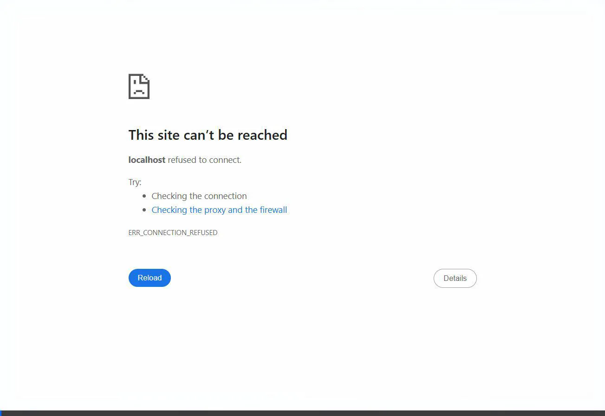

  
  <h1>AI Study Dashboard 🧠📚</h1>
  
<strong>A Next-Gen Retrieval-Augmented Generation (RAG) Platform for Subject-Specific Learning</strong>

  
  
  
  
  

 

## 🌟 Overview
**AI Study Dashboard** is a state-of-the-art web application designed to bridge the gap between static study materials and dynamic, AI-assisted learning. Built upon a powerful local vector database, the application securely digests PDF notes and restricts an advanced Large Language Model to answer questions **strictly based on the uploaded curriculum**. Say goodbye to AI hallucinations and generalized answers!

---

## 🔥 Key Features
- **Admin Document Management:** Secure backend panel for administrators to upload and ingest course-specific PDFs.
- **Strict-Context RAG Chatbot:** Conversational AI that is rigidly prompt-engineered to only source answers from uploaded texts, citing direct origin pages.
- **Glassmorphism UI:** Stunning, heavily animated frontend with deep dark-modes, gradient transitions, and responsive fluid design.
- **Zero-Cost Vector Processing:** Utilizes local `HuggingFaceEmbeddings` allowing 100% free vector chunking, coupled with built-in SQLite to bypass complex database configurations.

---

## 🎥 Walkthrough Demo

---

## 🛠️ Technology Stack
### 🖥️ Frontend
- **Framework & Tooling**: React, Vite
- **Styling**: Tailwind CSS v4 
- **Icons & Routing**: Lucide React, React Router
- **Security**: JWT-Decode

### ⚙️ Backend
- **Core API**: Flask
- **AI Engine**: Python Langchain, ChatGoogleGenerativeAI (Gemini fallback setup)
- **Vector Database**: FAISS, Sentence-Transformers
- **Data Persistence**: SQLite built-in processing

---

## 🚀 Quick Setup (1-Click Run)
If you clone this repository onto a local Windows environment, a unified Startup Script handles all dependencies automatically!

1. Clone the repository: `git clone https://github.com/Himasri2706/AI-STUDY-DASHBOARD.git`
2. Navigate inside the folder and double-click `start.bat`.
3. The script will automatically execute Python environment building, backend hosting, and Vite compilation inside two isolated terminal wrappers limitlessly!

### 🔐 Default Credentials
The internal SQLite database auto-builds two user tiers for instant out-of-the-box demonstration!

| Role | Username | Password |
|---|---|---|
| **Administrator** | `AdminMaster` | `admin123` |
| **Student** | `StudentPro` | `student123` |

---

  <i>A premier project showcasing powerful Document Parsing and Full Stack Application Orchestration.</i>

